  
  
  
<b>Construyendo experiencias digitales eficientes y seguras.</b>

  

  

  

    
    
    
  

---

### 👤 Perfil Profesional

Perfil orientado al **desarrollo web seguro**, con especial atención a la **ciberseguridad y al frontend**. Trabajo en la creación y análisis de aplicaciones web priorizando la seguridad, la calidad del código y la adopción de estándares reconocidos. 
Interesado en el uso de inteligencia artificial como apoyo en procesos técnicos. Si es necesario, puedo trabajar en proyectos fullstack.

---

### 🔍 Auditorías de seguridad

---

### 🧠 Stack Tecnológico
 

  

 

---

### 📊 Estadísticas de GitHub

  
  

   
  <picture>
    <source media="(prefers-color-scheme: dark)" srcset="https://raw.githubusercontent.com/tobiasmeyhoefer/tobiasmeyhoefer/output/github-snake-dark.svg" />
    <source media="(prefers-color-scheme: light)" srcset="https://raw.githubusercontent.com/tobiasmeyhoefer/tobiasmeyhoefer/output/github-snake.svg" />
    
  </picture>

---

